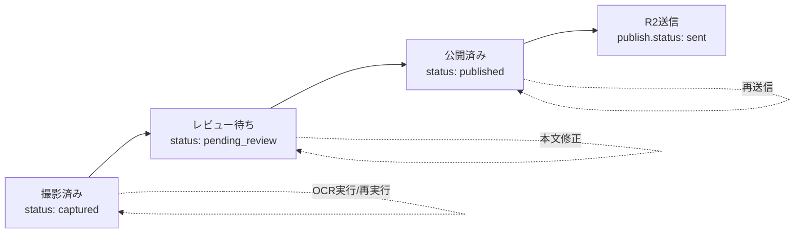

# 管理画面レビューUI カンバン仕様書

作成日: 2026-06-14

## 目的

WebAppで撮影・保存された付箋画像を、PC上の管理画面で高速に確認・修正・承認する。

OCR結果は手書き付箋のため誤認識を前提とし、公開前に人間が必ず確認する。レビュー担当が承認したものだけをCloudflare R2へ送信し、Unity/展示アプリが読む公開データに含める。

## 基本方針

管理画面の状態は「人間の作業段階」を中心にする。

OCR失敗、送信失敗、要注意などはメイン状態にせず、カード内のバッジ・警告・再実行アクションとして扱う。

理由:

- OCR失敗は再OCRすればよい
- 送信失敗は再送信すればよい
- 読み取りミスはレビュー画面で修正すればよい
- メイン列を増やすと作業対象が分散し、PCレビュー効率が落ちる

## 推奨ステータス

`CaptureRecord.status` は次の3段階を基本にする。

```ts
type CaptureStatus = "captured" | "pending_review" | "published";
```

表示名:

```text
captured        = 撮影済み
pending_review  = レビュー待ち
published       = 公開済み
```

### 補助ステータス

OCRやR2送信は、メインの `status` ではなく補助フィールドで管理する。

```ts
ocr: {
  status: "not_run" | "running" | "succeeded" | "failed";
  engine: "yomitoku";
  textRaw: string;
  textReviewed: string;
  ranAt: string;
  lastError: string | null;
}
```

```ts
publish: {
  status: "not_sent" | "sending" | "sent" | "failed";
  sentAt: string;
  lastError: string | null;
}
```

`published` は「レビュー済みで公開対象になった」状態を表す。R2送信が成功したかどうかは `publish.status` で見る。

## 状態遷移

```text
撮影済み
  -> OCR成功または手動レビュー開始
  -> レビュー待ち
  -> 承認
  -> 公開済み
  -> R2自動送信
```

Mermaid:



### OCR失敗時

`status` は `captured` のまま、または手動レビューできる場合は `pending_review` に進める。

カードには `OCR失敗` バッジと `再OCR` ボタンを出す。

### 不適切・公開しない投稿

通常の「却下」状態は作らない。必要な場合は公開除外フラグで扱う。

```ts
review: {
  excludeFromPublish: boolean;
  note: string;
}
```

ただし初期プロトタイプでは、公開除外は未実装でもよい。運用上どうしても必要になったら追加する。

## カンバン構成

PCレビュー効率を優先し、3列構成にする。

```text
撮影済み
レビュー待ち
公開済み
```

### 撮影済み列

まだレビュー対象として確定していない付箋。

含むもの:

- 撮影直後のレコード
- OCR未実行
- OCR実行中
- OCR失敗

カードアクション:

- OCR実行
- OCR再実行
- レビューへ送る
- 詳細を開く

### レビュー待ち列

レビュー担当が本文・名前・ジャンル・年代・座標を確認する主戦場。

含むもの:

- OCR成功後のレコード
- 手動でレビューに回したレコード

カードアクション:

- 詳細を開く
- 承認
- OCR再実行

### 公開済み列

レビュー承認済みの付箋。

含むもの:

- `status = published`
- R2送信待ち
- R2送信済み
- R2送信失敗

カードアクション:

- R2再送信
- 詳細確認
- レビューへ戻す

## カード表示

カード1枚を `CaptureRecord` 1件に対応させる。

カードに表示する情報:

- crop画像。なければ元画像
- 受付ID
- OCR状態バッジ
- R2送信状態バッジ
- 書いた人
- ジャンル
- 年代
- 座標の有無
- 撮影時刻
- 担当者

優先表示:

1. 画像
2. OCR/送信状態
3. 本文の先頭1〜2行
4. メタデータ

カード内の本文表示は短くし、編集は詳細パネルで行う。

## 詳細レビュー画面

カードクリックで右側の詳細パネル、または中央モーダルを開く。

PC作業効率を考えると、初期プロトタイプでは右側パネルを推奨する。カンバン列を見ながら次のカードに移りやすい。

### レイアウト

```text
左: カンバンボード
右: レビュー詳細パネル
```

詳細パネルの構成:

- 上部: crop画像を大きく表示
- 画像下: 元画像を開くリンク/切替
- 本文編集: OCR原文とレビュー本文
- メタデータ編集: 書いた人、ジャンル、年代、座標
- 操作: 保存、承認して公開、レビューへ戻す、再OCR、R2再送信

### OCR本文

表示:

```text
OCR原文: 読み取り結果そのまま
レビュー本文: 公開に使う修正文
```

初期値:

- `ocr.textReviewed` があればそれを表示
- なければ `ocr.textRaw`
- どちらもなければ空欄

公開データでは `ocr.textReviewed` を優先し、空なら `ocr.textRaw` を使う。ただし承認時にはレビュー本文が空なら警告する。

## キーボード操作

PCレビューではキーボード効率を重視する。

初期プロトタイプで入れたいショートカット:

```text
j / ↓       次のカード
k / ↑       前のカード
Enter       詳細を開く
Ctrl+S      保存
Ctrl+Enter  承認して公開
Esc         詳細を閉じる
/           検索欄へ移動
```

承認後は、自動で次の `レビュー待ち` カードを開く。

## 承認とR2送信

レビュー担当が `承認して公開` を押したら、次を1アクションで行う。

1. レビュー本文・メタデータを保存
2. `status = "published"` に更新
3. R2送信ジョブを実行
4. `publish.status` を更新
5. 公開manifestを再生成

R2送信に失敗しても、`status = "published"` は維持する。

理由:

- 人間のレビュー判断は完了している
- 送信失敗は機械処理の失敗なので、再送信すればよい
- 公開済み列に `送信失敗` バッジを出して再送信できるようにする

## API案

既存:

```text
GET /api/records
POST /api/captures
GET /api/captures/[fileName]
```

追加候補:

```text
PATCH /api/records/[id]
POST  /api/records/[id]/approve
POST  /api/records/[id]/run-ocr
POST  /api/records/[id]/publish
POST  /api/records/[id]/republish
```

初期実装では、APIを増やしすぎず次の2つにまとめてもよい。

```text
PATCH /api/records/[id]
POST  /api/records/[id]/actions
```

`actions` の例:

```json
{ "action": "approve-and-publish" }
```

```json
{ "action": "run-ocr" }
```

```json
{ "action": "republish" }
```

## データ更新方針

現在の保存構造:

```text
outputs/webapp-captures/<eventId>/
  captures/
  records/
  manifest.json
```

レビューUIは `records/<id>.json` を更新し、更新後に `manifest.json` を再生成する。

R2送信時は、ローカルのrecord JSONとmanifestを正としてR2へ同期する。

## 公開manifest方針

展示アプリ/Unity向けには、`status = published` かつ `publish.status = sent` のものだけを含む公開manifestを作る。

ただし運用初期では、R2送信直後に次のどちらかを採用する。

案A:

```text
published全件をmanifestに含める
```

案B:

```text
R2送信済みのみmanifestに含める
```

推奨は案B。画像URLが確実に存在するものだけ展示側へ渡せるため。

## UIプロトタイプ範囲

まず作るプロトタイプは、実API更新なしの見た目・操作感確認でよい。

対象:

- `/admin/review-prototype`
- ダミーデータまたは既存 `initialRecords` を利用
- 3列カンバン
- 右側レビュー詳細パネル
- キーボード操作の一部
- 承認ボタンの見た目
- OCR/R2状態バッジ

プロトタイプではR2送信やOCR実行はモックでよい。

## 本実装フェーズ

### フェーズ1: データモデル拡張

- `CaptureRecord.status` を3状態に整理
- `ocr` フィールド追加
- `publish` フィールド追加
- 既存record JSONとの互換性を保つ

### フェーズ2: OCR CLI

- `process_webapp_captures.py` を作る
- `capture.crop` 優先でOCR
- OCR結果を `ocr.textRaw` に保存
- `status = pending_review` に更新

### フェーズ3: レビュープロトタイプ

- 3列カンバン
- 詳細パネル
- 編集UI
- 承認導線

### フェーズ4: レビュー保存API

- record JSON更新API
- manifest再生成
- 楽観更新または更新後refresh

### フェーズ5: 承認時R2送信

- approve時にR2アップロード
- 失敗時は `publish.status = failed`
- 公開済み列で再送信可能にする

### フェーズ6: 公開manifest

- R2上にUnity/展示アプリ用manifestを出力
- `published` かつ `sent` のみ含める

## 未決定事項

- `published` の日本語表示を「公開済み」「承認済み」「送信対象済み」のどれにするか
- R2送信成功前の `published` を展示アプリへ含めるか
- 公開除外フラグを初期実装に入れるか
- 座標修正UIをレビュー詳細に含めるか、別のキャリブレーション画面に分けるか
- OCR再実行を管理画面から直接走らせるか、CLI/ワーカーに任せるか

## 推奨する次の作業

1. `/admin/review-prototype` を作る
2. 既存recordを3列に仮分類して表示する
3. 右側レビュー詳細パネルを作る
4. 「承認して公開」ボタンの操作感を確認する
5. その後、`CaptureRecord` とAPIを本実装へ進める
