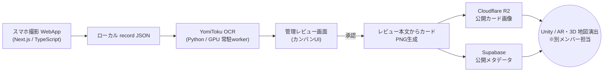

# 思い出マップ OCR / 配信パイプライン — 麗澤大学 Home Coming Day 2026

アナログ地図に来場者が貼った「手書きの思い出付箋」を、スマホ撮影 → OCR → レビュー → 配信まで一気通貫でデジタル化する Web アプリとデータパイプラインです。麗澤大学ホームカミングデー(HCD)の企画「思い出マップ」向けに開発し、**本番当日に実運用**しました。

生成した画像とメタデータは、地図上の AR / 3D 演出（別メンバー担当）から読み込まれ、来場者の思い出がその場で地図上に立ち上がります。

> 🟢 ホームカミングデー当日に稼働し、撮影から公開までを止めずに完走しました。

---

## デモ / スクリーンショット

<!-- TODO: 撮影フォーム / 管理レビュー画面 / 生成カード のスクショ・GIF を配置 -->
_（撮影フォーム・管理レビュー画面のスクリーンショットを追加予定）_

---

## システム全体像



撮影 WebApp は研究室 PC で起動し、Cloudflare Tunnel 経由で複数スマホから同時アクセスします。OCR は撮影と非同期に GPU 常駐ワーカーで処理し、レビュー承認後に公開物（カード PNG とメタデータ）だけを外部へ配信します。

---

## 主な機能

- **スマホ最適化の撮影フォーム**：カメラ撮影・ガイド枠クロップ・年代/ジャンル/大学内外・座標ミニマップ指定を1画面で完結
- **座標ミニマップ**：年代別の航空写真上でドラッグ&ピンチし、中心座標をリアルタイムに緯度経度へ変換
- **OCR パイプライン**：YomiToku(GPU) の常駐 watch ワーカーが新規撮影を自動処理
- **管理レビュー（カンバン）**：撮影済み→レビュー待ち→公開済みを高速レビュー。楽観ロックで複数人同時編集に対応
- **公開配信**：レビュー済み本文から正方形カード PNG を再生成し、Cloudflare R2 に公開
- **メタデータ同期**：公開セーフな項目のみを Supabase(PostgREST) へ upsert し、表示アプリ側が DB から読める形に

---

## 技術スタック

| 領域 | 使用技術 |
|---|---|
| フロント / サーバー | Next.js (App Router), TypeScript, Tailwind CSS |
| OCR | Python, YomiToku (CUDA / GPU) |
| ストレージ・配信 | Cloudflare R2, Cloudflare Tunnel |
| メタデータ DB | Supabase (PostgREST, Row Level Security) |
| 連携先 | Unity（AR / 3D 表示・別メンバー担当） |

---

## 設計上の工夫

- **楽観的ロック（version 方式）**：複数レビュワーの同時編集で後勝ち上書きが起きないよう、更新時に version を検証し競合は 409 で弾いて最新を提示。
- **冪等な content-hash キー**：レビュー本文・表示名・ジャンル・座標・撮影時刻から算出したハッシュを R2 キーと DB に用い、再送しても重複を作らない。内容が変わった時だけ新しい成果物になる。
- **配信順序の制御**：R2 の公開 URL を HEAD 検証してから Supabase へ upsert。購読側が画像より先にレコードを受け取り 404 になる realtime 競合を構造的に回避。
- **個人情報の分離**：R2 には公開カード画像のみ、Supabase には公開セーフなメタデータのみを送り、担当者名・OCR 原文・ローカルパスは外部に出さない。
- **「大学内/外」フラグの一気通貫**：人手判定した属性を撮影 → レビュー → 配信ファイル名 → DB まで一貫して流す。
- **非同期ワーカー構成**：撮影(WebApp)・OCR・R2 配信をそれぞれ独立プロセスにし、当日の負荷でも撮影を止めない。

---

## 体制と担当範囲

企画「思い出マップ」は総勢 10 名、うちデジタル班 4 名で開発しました。デジタル班の担当は次の通りです。

- 3D モデル制作（Blender）
- Unity への取り込み・AR / 演出
- データベース・全体設計
- **本リポジトリ全般（撮影 WebApp 〜 OCR 〜 管理レビュー 〜 Cloudflare R2 / Supabase 連携）← 私の担当**

私は、付箋撮影 WebApp・OCR パイプライン・管理レビュー画面・R2 公開・Supabase メタデータ同期について、**設計・実装・本番当日の運用まで**を担当しました。開発では AI コーディングエージェントをツールとして活用しつつ、アーキテクチャの設計判断・実装のディレクション・各サービスの統合・当日運用は自身で行いました。

---

## リポジトリ構成

```text
WebApp/         撮影WebApp・管理レビュー画面 (Next.js)
Codex-scripts/  OCR実行・カード生成・R2アップロード・Supabase同期スクリプト (Python)
Codex-docs/     設計メモ・運用ランブック・パイプライン仕様
outputs/        撮影画像・OCR結果のローカル出力先（Git管理外）
data/           OCR検証用データ（実データはGit管理外）
```

主要ドキュメント：
- [Codex-docs/public-card-r2-pipeline.md](Codex-docs/public-card-r2-pipeline.md) — 公開カード PNG の R2 配信仕様
- [Codex-docs/supabase-metadata-sync-plan.md](Codex-docs/supabase-metadata-sync-plan.md) — Supabase メタデータ同期の設計
- [Codex-docs/ocr-pipeline-runbook.md](Codex-docs/ocr-pipeline-runbook.md) — OCR パイプライン運用手順

---

## セットアップ（ローカル）

```powershell
# 撮影WebApp / 管理レビュー画面
cd WebApp
npm install
npm run build
npm run start        # http://localhost:3000  (/admin で管理レビュー)
```

```powershell
# OCR常駐ワーカー（GPU推奨）
uv run python Codex-scripts/process_webapp_captures.py `
  outputs/webapp-captures/reitaku-hcd-2026/manifest.json --watch --interval 1
```

Cloudflare R2 / Supabase の認証情報はリポジトリに含めず、プロジェクトルートの `.env.local`（Git 管理外）から読み込みます。

---

## ライセンス

MIT License（`LICENSE` を参照）
